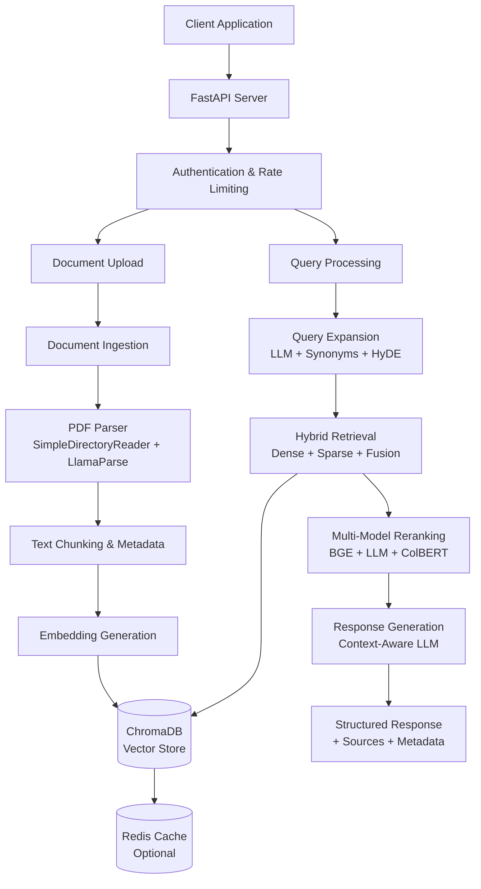

# TextReadingRAG 📚

**Advanced PDF RAG System with Hybrid Retrieval, Query Expansion, and Reranking**

A state-of-the-art Retrieval-Augmented Generation (RAG) system designed for processing and querying PDF documents using cutting-edge AI techniques. Built with FastAPI, LlamaIndex, and ChromaDB for production-ready document intelligence applications.

[](https://www.python.org/downloads/)
[](https://fastapi.tiangolo.com/)
[](https://llamaindex.ai/)
[](https://www.trychroma.com/)

## 🚀 Features

### Core Capabilities
- **📄 Multi-PDF Processing**: Upload and process multiple PDF documents simultaneously
- **🔍 Hybrid Search**: Combines dense vector search (semantic) with sparse BM25 search (keyword)
- **📝 Query Expansion**: Automatic query enhancement using LLM, synonyms, and HyDE techniques
- **🎯 Advanced Reranking**: Multi-model reranking with BGE, ColBERT, and LLM-based approaches
- **💬 Smart Q&A**: Context-aware question answering with source attribution
- **📊 Document Analysis**: Compare, summarize, and extract insights from documents
- **⚡ Real-time Streaming**: Server-sent events for live response generation

### Advanced RAG Features
- **Dynamic Retrieval Strategy**: Auto-selection based on query characteristics
- **Multi-stage Reranking**: Ensemble methods for optimal relevance
- **Context Window Optimization**: Intelligent chunk selection and context building
- **Citation Tracking**: Precise source attribution with page and section references
- **Confidence Scoring**: Reliability indicators for generated responses
- **Batch Processing**: Parallel query processing for high throughput

### Technical Excellence
- **🏗️ Modular Architecture**: Clean separation of concerns with extensible components
- **🔧 Production Ready**: Comprehensive error handling, logging, and monitoring
- **📈 Performance Optimized**: Async/await patterns and efficient vector operations
- **🐳 Docker Support**: Complete containerization with Docker Compose
- **🔒 Security First**: Input validation, rate limiting, and secure defaults
- **📱 API First**: RESTful API with OpenAPI documentation

## 🏛️ Architecture



### Component Overview

| Component | Technology | Purpose |
|-----------|------------|---------|
| **API Layer** | FastAPI | REST endpoints, request validation, error handling |
| **Document Ingestion** | LlamaIndex + LlamaParse | PDF processing, chunking, metadata extraction |
| **Vector Store** | ChromaDB | Hybrid vector/text search, persistence |
| **Retrieval Engine** | Custom Hybrid | Dense + sparse retrieval with fusion algorithms |
| **Query Expansion** | OpenAI + NLTK | Query enhancement and reformulation |
| **Reranking** | BGE + Sentence Transformers | Multi-stage relevance optimization |
| **LLM Integration** | OpenAI GPT | Response generation and reasoning |
| **Caching** | Redis (Optional) | Query and response caching |

## 🚀 Quick Start

### Prerequisites

- **Python 3.11+**
- **Docker & Docker Compose** (recommended)
- **OpenAI API Key** ([Get one here](https://platform.openai.com/api-keys))

### 1. Clone the Repository

```bash
git clone <repository-url>
cd TextReadingRAG
```

### 2. Environment Setup

```bash
# Copy environment template
cp .env.example .env

# Edit configuration (add your OpenAI API key)
nano .env
```

**Required Configuration:**
```env
OPENAI_API_KEY=your-openai-api-key-here
OPENAI_MODEL=gpt-4o-mini
OPENAI_EMBEDDING_MODEL=text-embedding-3-small
```

### 3. Start with Docker (Recommended)

```bash
# Start ChromaDB and Redis
docker-compose up -d

# Verify services are running
docker-compose ps
```

### 4. Install Python Dependencies

```bash
# Create virtual environment
python -m venv venv
source venv/bin/activate  # On Windows: venv\Scripts\activate

# Install dependencies
pip install -r requirements.txt
```

### 5. Run the API Server

```bash
# Start the FastAPI server
python -m uvicorn src.api.main:app --host 0.0.0.0 --port 8080 --reload
```

### 6. Verify Installation

Open your browser and navigate to:
- **API Documentation**: http://localhost:8080/docs
- **Health Check**: http://localhost:8080/health

## 📖 API Usage

### Upload Documents

```python
import requests

# Upload a single PDF
with open("document.pdf", "rb") as f:
    response = requests.post(
        "http://localhost:8080/api/documents/upload",
        files={"file": f},
        data={
            "collection_name": "my_docs",
            "use_llamaparse": "true",
            "chunk_size": "512"
        }
    )

print(response.json())
# Output: {"document_id": "...", "status": "pending", ...}
```

### Query Documents

```python
# Basic RAG query
query_data = {
    "query": "What are the main findings about climate change?",
    "query_type": "question_answer",
    "retrieval_strategy": "hybrid",
    "top_k": 5,
    "enable_query_expansion": True,
    "enable_reranking": True,
    "reranking_model": "BAAI/bge-reranker-large"
}

response = requests.post(
    "http://localhost:8080/api/query/",
    json=query_data
)

result = response.json()
print(f"Answer: {result['answer']}")
print(f"Sources: {len(result['retrieved_documents'])} documents")
print(f"Processing time: {result['processing_time_ms']:.2f}ms")
```

### Batch Processing

```python
# Process multiple queries in parallel
batch_data = {
    "queries": [
        {"query": "What is the methodology?", "top_k": 3},
        {"query": "What are the conclusions?", "top_k": 3},
        {"query": "What are the limitations?", "top_k": 3}
    ],
    "parallel_processing": True
}

response = requests.post(
    "http://localhost:8080/api/query/batch",
    json=batch_data
)

batch_result = response.json()
print(f"Completed: {batch_result['completed_queries']}/{batch_result['total_queries']}")
```

### Document Comparison

```python
# Compare multiple documents
comparison_data = {
    "document_ids": ["doc1", "doc2", "doc3"],
    "comparison_aspects": ["methodology", "findings", "conclusions"]
}

response = requests.post(
    "http://localhost:8080/api/query/compare",
    json=comparison_data
)

comparison = response.json()
print(f"Similarities: {comparison['similarities']}")
print(f"Differences: {comparison['differences']}")
```

### Streaming Responses

```python
import httpx

# Stream real-time responses
query_data = {
    "query": "Explain the research methodology",
    "retrieval_strategy": "hybrid",
    "enable_reranking": True
}

async with httpx.AsyncClient() as client:
    async with client.stream(
        "POST",
        "http://localhost:8080/api/query/stream",
        json=query_data
    ) as response:
        async for chunk in response.aiter_text():
            print(chunk, end="", flush=True)
```

## ⚙️ Configuration

### Environment Variables

| Variable | Default | Description |
|----------|---------|-------------|
| `OPENAI_API_KEY` | **Required** | OpenAI API key for embeddings and chat |
| `OPENAI_MODEL` | `gpt-4o-mini` | Chat model for response generation |
| `OPENAI_EMBEDDING_MODEL` | `text-embedding-3-small` | Embedding model |
| `CHROMA_HOST` | `localhost` | ChromaDB host |
| `CHROMA_PORT` | `8000` | ChromaDB port |
| `CHUNK_SIZE` | `512` | Text chunk size for documents |
| `CHUNK_OVERLAP` | `128` | Overlap between chunks |
| `DENSE_TOP_K` | `10` | Top-k for dense retrieval |
| `SPARSE_TOP_K` | `10` | Top-k for sparse retrieval |
| `ALPHA` | `0.5` | Dense vs sparse weight (0.0-1.0) |
| `RERANK_TOP_N` | `3` | Number of documents to rerank |
| `MAX_FILE_SIZE` | `50` | Maximum upload size (MB) |
| `ENABLE_CACHE` | `false` | Enable Redis caching |

### RAG Strategy Configuration

```python
# Hybrid Search Parameters
ALPHA = 0.5          # Balance: 0.0=BM25 only, 1.0=vector only
DENSE_TOP_K = 10     # Vector search results
SPARSE_TOP_K = 10    # BM25 search results
HYBRID_TOP_K = 5     # Final fused results

# Query Expansion
ENABLE_QUERY_EXPANSION = True
EXPANSION_METHODS = ["llm", "synonym"]  # Available: llm, synonym, hyde
MAX_EXPANDED_QUERIES = 3

# Reranking
RERANK_MODEL = "BAAI/bge-reranker-large"  # Options: bge-*, sentence-transformer, llm-rerank
RERANK_TOP_N = 3
USE_LLM_RERANK = True
```

## 🐳 Docker Deployment

### Development Mode

```bash
# Start all services for development
docker-compose up -d

# View logs
docker-compose logs -f chromadb
```

### Production Mode

```bash
# Start with production profile (includes Nginx)
docker-compose --profile production up -d

# Scale API instances
docker-compose --profile full-stack up -d --scale api=3
```

### Custom Configuration

```yaml
# docker-compose.override.yml
version: '3.8'
services:
  chromadb:
    environment:
      - CHROMA_LOG_LEVEL=INFO
    volumes:
      - /host/path/chroma:/chroma/chroma

  api:
    environment:
      - WORKERS=4
      - LOG_LEVEL=INFO
    deploy:
      replicas: 2
      resources:
        limits:
          memory: 2G
```

## 📊 Performance Optimization

### Retrieval Tuning

```python
# For factual queries - favor keyword search
{
    "retrieval_strategy": "hybrid",
    "alpha": 0.2,  # More weight on BM25
    "sparse_top_k": 15,
    "dense_top_k": 5
}

# For conceptual queries - favor semantic search
{
    "retrieval_strategy": "hybrid",
    "alpha": 0.8,  # More weight on vector search
    "sparse_top_k": 5,
    "dense_top_k": 15
}
```

### Chunking Strategy

```python
# For technical documents
CHUNK_SIZE = 512
CHUNK_OVERLAP = 128

# For narrative documents
CHUNK_SIZE = 1024
CHUNK_OVERLAP = 256

# For dense reference material
CHUNK_SIZE = 256
CHUNK_OVERLAP = 64
```

### Caching Configuration

```bash
# Enable Redis caching for better performance
ENABLE_CACHE=true
CACHE_TTL=3600  # 1 hour
```

## 🔧 Advanced Features

### Custom Reranking Ensemble

```python
# Configure ensemble reranking
rerankers = [
    ("bge", CrossEncoderReranker("BAAI/bge-reranker-large"), 0.7),
    ("llm", LLMReranker(), 0.3)
]

ensemble = EnsembleReranker(
    rerankers=rerankers,
    fusion_method="weighted_average"
)
```

### Query Strategy Selection

```python
def get_optimal_strategy(query: str) -> dict:
    """Auto-select best retrieval strategy based on query."""

    query_lower = query.lower()

    if any(word in query_lower for word in ["what is", "define", "definition"]):
        # Factual queries - favor BM25
        return {"alpha": 0.2, "strategy": "hybrid"}

    elif len(query.split()) > 10:
        # Complex queries - favor semantic
        return {"alpha": 0.8, "strategy": "hybrid"}

    else:
        # Balanced approach
        return {"alpha": 0.5, "strategy": "hybrid"}
```

### Custom Prompt Templates

```python
# Domain-specific prompt template
RESEARCH_PROMPT = """
Based on the provided research context, answer the question with:
1. Direct answer
2. Supporting evidence
3. Confidence level
4. Limitations

Context: {context}
Question: {question}

Answer:
"""
```

## 🛠️ Development

### Setup Development Environment

```bash
# Install development dependencies
pip install -e .
pip install pytest pytest-asyncio black isort mypy

# Run tests
pytest tests/ -v

# Code formatting
black src/
isort src/

# Type checking
mypy src/
```

### Running Tests

```bash
# Unit tests
pytest tests/unit/ -v

# Integration tests
pytest tests/integration/ -v

# End-to-end tests
pytest tests/e2e/ -v

# With coverage
pytest --cov=src tests/
```

### Contributing

1. **Fork the repository**
2. **Create a feature branch**: `git checkout -b feature/amazing-feature`
3. **Follow coding standards**: Use black, isort, and mypy
4. **Write tests**: Maintain >90% test coverage
5. **Update documentation**: Keep README and docstrings current
6. **Submit a pull request**: Include detailed description

## 🐛 Troubleshooting

### Common Issues

**ChromaDB Connection Error**
```bash
# Check if ChromaDB is running
docker-compose ps chromadb

# Restart ChromaDB
docker-compose restart chromadb

# Check logs
docker-compose logs chromadb
```

**OpenAI API Errors**
```bash
# Verify API key is set
echo $OPENAI_API_KEY

# Test API connectivity
curl -H "Authorization: Bearer $OPENAI_API_KEY" \
     "https://api.openai.com/v1/models"
```

**Memory Issues**
```bash
# Increase Docker memory limit
# Docker Desktop > Settings > Resources > Memory: 8GB+

# Monitor memory usage
docker stats
```

**PDF Processing Failures**
```bash
# Check file permissions
chmod 644 uploads/*.pdf

# Verify file format
file uploads/document.pdf

# Enable debug logging
LOG_LEVEL=DEBUG python -m uvicorn src.api.main:app
```

### Performance Debugging

```python
# Enable detailed timing
import time

start = time.time()
result = await query_documents(request)
print(f"Total time: {time.time() - start:.2f}s")

# Check component timing
print(f"Retrieval: {result.retrieval_time_ms}ms")
print(f"Reranking: {result.reranking_time_ms}ms")
print(f"Generation: {result.generation_time_ms}ms")
```

## 📈 Monitoring & Observability

### Health Checks

```bash
# API health
curl http://localhost:8080/health

# Detailed health check
curl http://localhost:8080/health/detailed

# ChromaDB health
curl http://localhost:8000/api/v1/heartbeat
```

### Metrics Collection

```python
# Custom metrics endpoint
@app.get("/metrics")
async def get_metrics():
    return {
        "queries_per_minute": query_counter.rate(),
        "avg_response_time": response_timer.average(),
        "error_rate": error_counter.rate(),
        "active_connections": connection_gauge.value()
    }
```

## 🔮 Roadmap

### Upcoming Features
- [ ] **Multi-modal Support**: Images, tables, and charts in PDFs
- [ ] **Fine-tuned Models**: Domain-specific embedding models
- [ ] **Graph RAG**: Knowledge graph integration
- [ ] **Federated Search**: Multi-source document retrieval
- [ ] **Advanced Analytics**: Query pattern analysis and optimization
- [ ] **API Keys & Auth**: Production authentication system
- [ ] **WebSocket Support**: Real-time collaborative queries
- [ ] **Export Features**: Query results to various formats

### Performance Goals
- [ ] **Sub-100ms** retrieval for cached queries
- [ ] **1000+ QPS** throughput with horizontal scaling
- [ ] **99.9%** uptime with proper deployment
- [ ] **<1GB** memory usage per API instance

## 📄 License

This project is licensed under the MIT License - see the [LICENSE](LICENSE) file for details.

## 🤝 Support

- **Documentation**: [API Docs](http://localhost:8080/docs)
- **Issues**: [GitHub Issues](https://github.com/your-repo/issues)
- **Discussions**: [GitHub Discussions](https://github.com/your-repo/discussions)

## 🙏 Acknowledgments

- **LlamaIndex**: Excellent RAG framework and documentation
- **ChromaDB**: High-performance vector database
- **OpenAI**: Powerful embedding and language models
- **FastAPI**: Modern, fast web framework for APIs
- **Hugging Face**: Pre-trained reranking models

---

**Built with ❤️ for the AI community**

*Ready to revolutionize how you interact with documents? Get started now!*