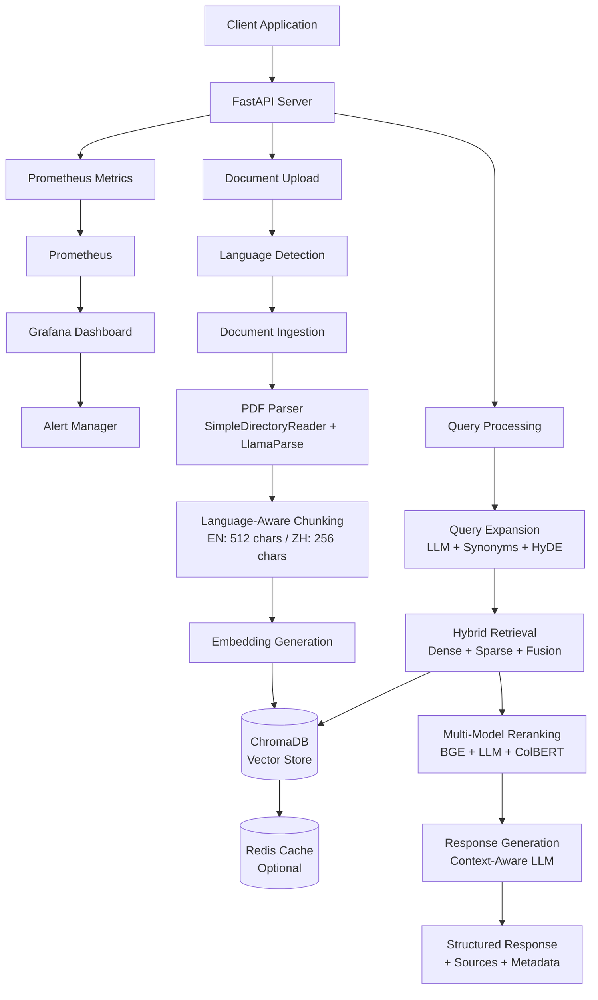

# TextReadingRAG 📚

**Advanced PDF RAG System with Hybrid Retrieval, Query Expansion, Reranking, and Production Monitoring**

A state-of-the-art Retrieval-Augmented Generation (RAG) system designed for processing and querying PDF documents using cutting-edge AI techniques. Built with FastAPI, LlamaIndex, and ChromaDB for production-ready document intelligence applications with full Chinese language support and comprehensive observability.

[](https://www.python.org/downloads/)
[](https://fastapi.tiangolo.com/)
[](https://llamaindex.ai/)
[](https://www.trychroma.com/)
[](https://prometheus.io/)
[](https://grafana.com/)

## 🚀 Features

### Core Capabilities
- **📄 Multi-PDF Processing**: Upload and process multiple PDF documents simultaneously
- **🔍 Hybrid Search**: Combines dense vector search (semantic) with sparse BM25 search (keyword)
- **📝 Query Expansion**: Automatic query enhancement using LLM, synonyms, and HyDE techniques
- **🎯 Advanced Reranking**: Multi-model reranking with BGE, ColBERT, and LLM-based approaches
- **💬 Smart Q&A**: Context-aware question answering with source attribution
- **📊 Document Analysis**: Compare, summarize, and extract insights from documents
- **⚡ Real-time Streaming**: Server-sent events for live response generation
- **🇨🇳 Chinese Language Support**: Full support for Traditional and Simplified Chinese

### Advanced RAG Features
- **Dynamic Retrieval Strategy**: Auto-selection based on query characteristics
- **Multi-stage Reranking**: Ensemble methods for optimal relevance
- **Context Window Optimization**: Intelligent chunk selection and context building
- **Citation Tracking**: Precise source attribution with page and section references
- **Confidence Scoring**: Reliability indicators for generated responses
- **Batch Processing**: Parallel query processing for high throughput
- **Language-Aware Processing**: Optimized chunking and tokenization for Chinese/English

### Production Features
- **🏗️ Modular Architecture**: Clean separation of concerns with extensible components
- **🔧 Production Ready**: Comprehensive error handling, logging, and monitoring
- **📈 Performance Optimized**: Async/await patterns and efficient vector operations
- **🐳 Docker Support**: Complete containerization with Docker Compose profiles
- **🔒 Security First**: Input validation, rate limiting, and secure defaults
- **📱 API First**: RESTful API with OpenAPI documentation
- **📊 Observability**: Prometheus metrics + Grafana dashboards + Alerting
- **🧪 Comprehensive Testing**: Full test suite with Chinese language support

## 🏛️ Architecture



### Component Overview

| Component | Technology | Purpose |
|-----------|------------|---------|
| **API Layer** | FastAPI | REST endpoints, request validation, error handling |
| **Document Ingestion** | LlamaIndex + LlamaParse | PDF processing, chunking, metadata extraction |
| **Language Detection** | langdetect + jieba | Automatic language detection, Chinese tokenization |
| **Vector Store** | ChromaDB | Hybrid vector/text search, persistence |
| **Retrieval Engine** | Custom Hybrid | Dense + sparse retrieval with fusion algorithms |
| **Query Expansion** | OpenAI + NLTK | Query enhancement and reformulation |
| **Reranking** | BGE + Sentence Transformers | Multi-stage relevance optimization |
| **LLM Integration** | OpenAI GPT | Response generation and reasoning |
| **Caching** | Redis (Optional) | Query and response caching |
| **Monitoring** | Prometheus + Grafana | Metrics collection, visualization, alerting |

## 🚀 Quick Start

### Prerequisites

- **Python 3.11+**
- **Docker & Docker Compose** (recommended)
- **OpenAI API Key** ([Get one here](https://platform.openai.com/api-keys))

### 1. Clone the Repository

```bash
git clone https://github.com/jaujye/TextReadingRAG.git
cd TextReadingRAG
```

### 2. Environment Setup

```bash
# Copy environment template
cp .env.example .env

# Edit configuration (add your OpenAI API key)
nano .env
```

**Required Configuration:**
```env
OPENAI_API_KEY=your-openai-api-key-here
OPENAI_MODEL=gpt-4o-mini
OPENAI_EMBEDDING_MODEL=text-embedding-3-small
```

### 3. Start with Docker (Recommended)

```bash
# Start ChromaDB and Redis
docker-compose up -d

# (Optional) Start with monitoring stack
docker-compose --profile monitoring up -d

# Verify services are running
docker-compose ps
```

### 4. Install Python Dependencies

```bash
# Create virtual environment
python -m venv venv
source venv/bin/activate  # On Windows: venv\Scripts\activate

# Install dependencies
pip install -r requirements.txt
```

### 5. Run the API Server

```bash
# Start the FastAPI server
python -m uvicorn src.api.main:app --host 0.0.0.0 --port 8080 --reload
```

### 6. Verify Installation

Open your browser and navigate to:
- **API Documentation**: http://localhost:8080/docs
- **Health Check**: http://localhost:8080/health
- **Metrics**: http://localhost:8080/metrics
- **Grafana Dashboard** (if monitoring enabled): http://localhost:3000

## 🌏 Chinese Language Support

TextReadingRAG has **native support for Chinese language** processing with optimized chunking, tokenization, and retrieval.

### Features
- ✅ **Automatic Language Detection**: Detects Chinese vs English content
- ✅ **Jieba Tokenization**: Chinese word segmentation for BM25 search
- ✅ **Optimized Chunking**: 256 characters for Chinese (vs 512 for English)
- ✅ **Traditional & Simplified**: Supports both variants
- ✅ **Mixed Content**: Handles documents with both Chinese and English

### Quick Start (Chinese)

```python
import requests

# Upload Chinese PDF
with open("中文文档.pdf", "rb") as f:
    response = requests.post(
        "http://localhost:8080/api/documents/upload",
        files={"file": f},
        data={"collection_name": "chinese_docs"}
    )

# Query in Chinese
query_data = {
    "query": "這份文件的主要內容是什麼?",
    "query_type": "question_answer",
    "retrieval_strategy": "hybrid",
    "enable_query_expansion": True
}

response = requests.post(
    "http://localhost:8080/api/query/",
    json=query_data
)
```

📖 **Full Documentation**: [Chinese Language Support Guide](docs/CHINESE_SUPPORT.md) | [中文快速開始](docs/CHINESE_QUICK_START.md)

## 📖 API Usage

### Upload Documents

```python
import requests

# Upload a single PDF
with open("document.pdf", "rb") as f:
    response = requests.post(
        "http://localhost:8080/api/documents/upload",
        files={"file": f},
        data={
            "collection_name": "my_docs",
            "use_llamaparse": "false",
            "chunk_size": "512"
        }
    )

print(response.json())
# Output: {"document_id": "...", "status": "pending", ...}

# Batch upload (up to 5 files)
files = [
    ("files", open("doc1.pdf", "rb")),
    ("files", open("doc2.pdf", "rb")),
]
response = requests.post(
    "http://localhost:8080/api/documents/upload/batch",
    files=files,
    data={"collection_name": "batch_docs"}
)
```

### Query Documents

```python
# Basic RAG query
query_data = {
    "query": "What are the main findings about climate change?",
    "query_type": "question_answer",
    "retrieval_strategy": "hybrid",
    "top_k": 5,
    "enable_query_expansion": True,
    "enable_reranking": True,
    "reranking_model": "BAAI/bge-reranker-large"
}

response = requests.post(
    "http://localhost:8080/api/query/",
    json=query_data
)

result = response.json()
print(f"Answer: {result['answer']}")
print(f"Sources: {len(result['retrieved_documents'])} documents")
print(f"Processing time: {result['processing_time_ms']:.2f}ms")
```

### Batch Processing

```python
# Process multiple queries in parallel
batch_data = {
    "queries": [
        {"query": "What is the methodology?", "top_k": 3},
        {"query": "What are the conclusions?", "top_k": 3},
        {"query": "What are the limitations?", "top_k": 3}
    ],
    "parallel_processing": True
}

response = requests.post(
    "http://localhost:8080/api/query/batch",
    json=batch_data
)

batch_result = response.json()
print(f"Completed: {batch_result['completed_queries']}/{batch_result['total_queries']}")
```

### Document Comparison

```python
# Compare multiple documents
comparison_data = {
    "document_ids": ["doc1", "doc2", "doc3"],
    "comparison_aspects": ["methodology", "findings", "conclusions"]
}

response = requests.post(
    "http://localhost:8080/api/query/compare",
    json=comparison_data
)

comparison = response.json()
print(f"Similarities: {comparison['similarities']}")
print(f"Differences: {comparison['differences']}")
```

### Streaming Responses

```python
import httpx

# Stream real-time responses
query_data = {
    "query": "Explain the research methodology",
    "retrieval_strategy": "hybrid",
    "enable_reranking": True
}

async with httpx.AsyncClient() as client:
    async with client.stream(
        "POST",
        "http://localhost:8080/api/query/stream",
        json=query_data
    ) as response:
        async for chunk in response.aiter_text():
            print(chunk, end="", flush=True)
```

### Document Management

```python
# List all documents
response = requests.get("http://localhost:8080/api/documents/list")
documents = response.json()

# Get document progress
doc_id = "abc123"
response = requests.get(f"http://localhost:8080/api/documents/progress/{doc_id}")
progress = response.json()
print(f"Status: {progress['status']}, Progress: {progress['progress']}%")

# Delete document
requests.delete(f"http://localhost:8080/api/documents/{doc_id}")
```

## 📊 Monitoring & Observability

TextReadingRAG includes **production-grade monitoring** with Prometheus and Grafana.

### Features
- **30+ Metrics**: HTTP requests, RAG pipeline performance, resource usage
- **Pre-built Dashboard**: 16 panels covering all aspects of the system
- **30+ Alert Rules**: Critical alerts for API, RAG components, and infrastructure
- **Exporters**: Redis, Node, cAdvisor for complete observability

### Quick Start Monitoring

```bash
# Start monitoring stack
docker-compose --profile monitoring up -d

# Access interfaces
# Grafana: http://localhost:3000 (admin/admin)
# Prometheus: http://localhost:9090
# Metrics: http://localhost:8080/metrics
```

### Key Metrics

| Metric | Description |
|--------|-------------|
| `http_requests_total` | Total HTTP requests by endpoint, method, status |
| `http_request_duration_seconds` | Request latency distribution |
| `rag_retrieval_duration_seconds` | Document retrieval performance |
| `rag_reranking_duration_seconds` | Reranking stage latency |
| `rag_generation_duration_seconds` | LLM response generation time |
| `rag_retrieval_quality_score` | Quality of retrieved documents |
| `rag_documents_indexed_total` | Total documents processed |
| `rag_query_expansion_errors_total` | Query expansion failures |

### Sample Queries

```promql
# API request rate
rate(http_requests_total{job="textreadingrag-api"}[5m])

# P95 retrieval latency
histogram_quantile(0.95, rate(rag_retrieval_duration_seconds_bucket[5m]))

# Error rate by component
sum(rate(rag_retrieval_errors_total[5m])) by (error_type)
```

📖 **Full Documentation**: [Monitoring Guide](docs/MONITORING.md) | [Quick Start](MONITORING_QUICKSTART.md)

## ⚙️ Configuration

### Environment Variables

| Variable | Default | Description |
|----------|---------|-------------|
| `OPENAI_API_KEY` | **Required** | OpenAI API key for embeddings and chat |
| `OPENAI_MODEL` | `gpt-4o-mini` | Chat model for response generation |
| `OPENAI_EMBEDDING_MODEL` | `text-embedding-3-small` | Embedding model |
| `CHROMA_HOST` | `localhost` | ChromaDB host |
| `CHROMA_PORT` | `8000` | ChromaDB port |
| `CHUNK_SIZE` | `512` | Text chunk size for documents (English) |
| `CHINESE_CHUNK_SIZE` | `256` | Text chunk size for Chinese documents |
| `CHUNK_OVERLAP` | `128` | Overlap between chunks |
| `DENSE_TOP_K` | `10` | Top-k for dense retrieval |
| `SPARSE_TOP_K` | `10` | Top-k for sparse retrieval |
| `ALPHA` | `0.5` | Dense vs sparse weight (0.0-1.0) |
| `RERANK_TOP_N` | `3` | Number of documents to rerank |
| `MAX_FILE_SIZE` | `50` | Maximum upload size (MB) |
| `ENABLE_CACHE` | `false` | Enable Redis caching |
| `ENABLE_LANGUAGE_DETECTION` | `true` | Auto-detect document language |

### RAG Strategy Configuration

```python
# Hybrid Search Parameters
ALPHA = 0.5          # Balance: 0.0=BM25 only, 1.0=vector only
DENSE_TOP_K = 10     # Vector search results
SPARSE_TOP_K = 10    # BM25 search results
HYBRID_TOP_K = 5     # Final fused results

# Query Expansion
ENABLE_QUERY_EXPANSION = True
EXPANSION_METHODS = ["llm", "synonym"]  # Available: llm, synonym, hyde
MAX_EXPANDED_QUERIES = 3

# Reranking
RERANK_MODEL = "BAAI/bge-reranker-large"  # Options: bge-*, sentence-transformer, llm-rerank
RERANK_TOP_N = 3
USE_LLM_RERANK = True

# Chinese Language
SUPPORTED_LANGUAGES = ["en", "zh"]
CHINESE_CHUNK_SIZE = 256
CHINESE_CHUNK_OVERLAP = 64
```

## 🐳 Docker Deployment

### Development Mode

```bash
# Start core services
docker-compose up -d

# View logs
docker-compose logs -f chromadb
```

### Production Mode with Monitoring

```bash
# Start full stack with monitoring
docker-compose --profile monitoring up -d

# Check all services
docker-compose ps

# View Grafana dashboard
open http://localhost:3000
```

### Full Stack (API + Monitoring)

```bash
# Start everything including containerized API
docker-compose --profile full-stack --profile monitoring up -d

# Scale API instances
docker-compose --profile full-stack up -d --scale api=3
```

### Available Services

| Service | Port | Profile | Description |
|---------|------|---------|-------------|
| ChromaDB | 8000 | default | Vector database |
| Redis | 6379 | default | Optional cache |
| API | 8080 | full-stack | FastAPI application |
| Prometheus | 9090 | monitoring | Metrics collection |
| Grafana | 3000 | monitoring | Visualization |
| Redis Exporter | 9121 | monitoring | Redis metrics |
| Node Exporter | 9100 | monitoring | System metrics |
| cAdvisor | 8081 | monitoring | Container metrics |
| Nginx | 80/443 | production | Reverse proxy |

## 📈 Performance Optimization

### Retrieval Tuning

```python
# For factual queries - favor keyword search
{
    "retrieval_strategy": "hybrid",
    "alpha": 0.2,  # More weight on BM25
    "sparse_top_k": 15,
    "dense_top_k": 5
}

# For conceptual queries - favor semantic search
{
    "retrieval_strategy": "hybrid",
    "alpha": 0.8,  # More weight on vector search
    "sparse_top_k": 5,
    "dense_top_k": 15
}
```

### Chunking Strategy

```python
# For technical documents
CHUNK_SIZE = 512
CHUNK_OVERLAP = 128

# For narrative documents
CHUNK_SIZE = 1024
CHUNK_OVERLAP = 256

# For dense reference material
CHUNK_SIZE = 256
CHUNK_OVERLAP = 64

# For Chinese documents (automatic)
CHINESE_CHUNK_SIZE = 256
CHINESE_CHUNK_OVERLAP = 64
```

### Caching Configuration

```bash
# Enable Redis caching for better performance
ENABLE_CACHE=true
CACHE_TTL=3600  # 1 hour
```

## 🧪 Testing

### Run Tests

```bash
# All tests
pytest tests/ -v

# Specific test suites
pytest tests/test_api/ -v              # API tests
pytest tests/test_rag/ -v              # RAG component tests
pytest tests/test_rag/test_chinese_support.py -v  # Chinese language tests

# With coverage
pytest --cov=src tests/
```

### Test Coverage

- ✅ API endpoint tests (query, document upload, batch processing)
- ✅ RAG pipeline tests (retrieval, reranking, query expansion)
- ✅ Chinese language support tests (detection, tokenization)
- ✅ Document processing tests
- ✅ Error handling tests

## 🛠️ Development

### Setup Development Environment

```bash
# Install development dependencies
pip install -e .
pip install pytest pytest-asyncio pytest-mock black isort mypy

# Code formatting
black src/
isort src/

# Type checking
mypy src/
```

## 📚 Documentation

| Document | Description |
|----------|-------------|
| [README.md](README.md) | Main project documentation (this file) |
| [CHINESE_SUPPORT.md](docs/CHINESE_SUPPORT.md) | Chinese language features guide |
| [CHINESE_QUICK_START.md](docs/CHINESE_QUICK_START.md) | Chinese quick start guide |
| [MONITORING.md](docs/MONITORING.md) | Monitoring setup and metrics guide |
| [MONITORING_QUICKSTART.md](MONITORING_QUICKSTART.md) | Quick monitoring setup |
| [PRODUCTION_DEPLOYMENT.md](docs/PRODUCTION_DEPLOYMENT.md) | Production deployment guide |
| [API Documentation](http://localhost:8080/docs) | Interactive API docs (when server running) |

## 🐛 Troubleshooting

### Common Issues

**ChromaDB Connection Error**
```bash
# Check if ChromaDB is running
docker-compose ps chromadb

# Restart ChromaDB
docker-compose restart chromadb

# Check logs
docker-compose logs chromadb
```

**OpenAI API Errors**
```bash
# Verify API key is set
echo $OPENAI_API_KEY

# Test API connectivity
curl -H "Authorization: Bearer $OPENAI_API_KEY" \
     "https://api.openai.com/v1/models"
```

**Memory Issues**
```bash
# Increase Docker memory limit
# Docker Desktop > Settings > Resources > Memory: 8GB+

# Monitor memory usage
docker stats
```

**Chinese Text Not Processing Correctly**
```bash
# Ensure jieba is installed
pip install jieba

# Check language detection
python -c "from src.rag.language_utils import detect_language; print(detect_language('這是中文'))"
```

## 🔮 Roadmap

### Completed Features
- ✅ Hybrid retrieval (dense + sparse)
- ✅ Multi-model reranking
- ✅ Query expansion (LLM + Synonym + HyDE)
- ✅ Chinese language support
- ✅ Prometheus + Grafana monitoring
- ✅ Comprehensive testing
- ✅ Production deployment guide
- ✅ Batch processing
- ✅ Streaming responses
- ✅ Document comparison

### Upcoming Features
- [ ] **Multi-modal Support**: Images, tables, and charts in PDFs
- [ ] **Fine-tuned Models**: Domain-specific embedding models
- [ ] **Graph RAG**: Knowledge graph integration
- [ ] **Federated Search**: Multi-source document retrieval
- [ ] **Advanced Analytics**: Query pattern analysis and optimization
- [ ] **API Keys & Auth**: Production authentication system
- [ ] **WebSocket Support**: Real-time collaborative queries
- [ ] **Export Features**: Query results to various formats

## 📄 License

This project is licensed under the MIT License - see the [LICENSE](LICENSE) file for details.

## 🤝 Support

- **Documentation**: [API Docs](http://localhost:8080/docs)
- **Issues**: [GitHub Issues](https://github.com/jaujye/TextReadingRAG/issues)
- **Repository**: [GitHub](https://github.com/jaujye/TextReadingRAG)

## 🙏 Acknowledgments

- **LlamaIndex**: Excellent RAG framework and documentation
- **ChromaDB**: High-performance vector database
- **OpenAI**: Powerful embedding and language models
- **FastAPI**: Modern, fast web framework for APIs
- **Hugging Face**: Pre-trained reranking models
- **Prometheus & Grafana**: Outstanding monitoring tools
- **jieba**: Excellent Chinese text segmentation

---

**Built with ❤️ for the AI community**

*Ready to revolutionize how you interact with documents? Get started now!*

## 🚦 Quick Links

- 📖 [API Documentation](http://localhost:8080/docs) - Interactive API reference
- 🇨🇳 [Chinese Support Guide](docs/CHINESE_SUPPORT.md) - Chinese language features
- 📊 [Monitoring Guide](docs/MONITORING.md) - Prometheus + Grafana setup
- 🚀 [Production Deployment](docs/PRODUCTION_DEPLOYMENT.md) - Production deployment
- 🧪 [Run Tests](tests/) - Comprehensive test suite
- 📈 [Grafana Dashboard](http://localhost:3000) - Real-time monitoring
